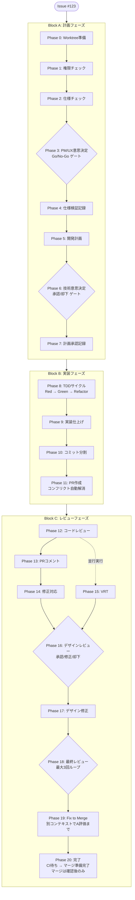

# native-app-fullcycle

モバイル開発向けフルサイクル開発ワークフローの Claude Code プラグイン。

GitHub Issue を起点に、仕様チェック → 計画 → TDD実装 → コードレビュー → デザインレビュー → VRT → PR作成までを一気通貫で実行します。

## 免責事項

**本プラグインは、ユーザーのリポジトリに対する git / GitHub 操作を自動実行します。** 導入前に必ずご確認ください。

- **自動実行される操作**: ブランチ・worktree の作成、コミット、**push**、**PR 作成**、PR へのコメント投稿。インタラクティブ実行では確認のうえ **PR のマージとリモートブランチ削除** も実行できます（Phase 20。デフォルトは「マージ準備完了の報告」までで、マージは確認後のみ。`/parallel-full-cycle` の自律実行ではマージしません）。
- **AI 生成コードの非保証**: 本プラグインが生成・修正するコード、およびレビュー・ガイドラインチェックの結果は AI によるものであり、正確性・安全性・ストア審査の通過を保証しません。マージ・リリースの最終判断と検証は利用者の責任で行ってください。
- **重要なリポジトリでの推奨設定**: branch protection（必須レビュー・必須 CI）を有効にし、`.claude/settings.json` の `allow` から `Bash(git push*)` / `gh pr merge` 系を外すなど、自動操作を必要最小限に絞ることを推奨します。

本プラグインは MIT ライセンスで「現状のまま（AS IS）」提供され、利用により生じたいかなる損害についても作者は責任を負いません。

なお本プラグインは個人によるベストエフォートのメンテナンスです。Issue・Pull Request の確認や返信、機能要望への対応は保証されません（無保証・現状提供の一環）。利用は各自の責任でお願いします。

## インストール

```bash
# marketplace から（推奨）
claude plugin marketplace add ohzono/native-app-fullcycle
claude plugin install mobiledev-fullcycle

# またはローカルクローンから
git clone https://github.com/ohzono/native-app-fullcycle.git
claude plugin add /path/to/native-app-fullcycle
```

> 外部依存（android/skills, swiftui-pro）はすべて **vendored copy として同梱**されているため、submodule の初期化は不要です。marketplace 経由・ローカルクローンのどちらでも全 skill がそのまま利用できます。

### 前提とするツール（Prerequisites）

プラグイン本体は Markdown + 少量の bash スクリプトで動作しますが、skill / agent が前提とするホスト側ツールは実際のモバイル開発タスクで必要になります。

- **共通**: `git`, `gh`（GitHub CLI）, `bash`, `jq`（推奨。Phase 2.5 で使用）, `python3`（一部スクリプトのフォールバックで使用）
- **iOS / macOS**: Xcode（`xcodebuild` / `xcrun` / `simctl`）。**Tuist** は同梱の KMP テンプレート（`templates/kmp-ios-android`）および フルサイクルの iOS フローで**必須**です（`iosApp` は `.xcodeproj` を同梱せず `tuist generate` で生成するため）。Android のみ、または自前の既存 iOS プロジェクトを使う場合は不要です。
- **Android**: JDK と Gradle（テンプレートは Gradle wrapper を同梱）

> いずれも本プラグインには同梱されません。利用する skill に応じて各自インストールしてください。

### プロジェクト依存で追加が必要になるツール（条件付き）

以下は本プラグインの前提ではなく、**対象プロジェクトがそのツールを使っている場合にのみ**一部 skill が利用する条件付き依存です（プロジェクト構成しだい）。

- `pr-conflict-resolution`: プロジェクトが CocoaPods を使う場合は `pod`、XcodeGen を使う場合は `xcodegen`（`Podfile.lock` / `project.pbxproj` のコンフリクトを再生成で解消）
- `security`: JS/Node プロジェクトの依存監査で `npm audit` / `snyk`
- `design-review`: 画像処理に `sips`（macOS 標準同梱・追加インストール不要）

### 外部依存

- [android/skills](https://github.com/android/skills) (Apache 2.0, © Google LLC) を `vendor/android-skills/` に **vendored copy** として同梱し、AGP アップグレード・Compose マイグレーション・Navigation 3 等の skill を提供しています（これらは Google 公式リポジトリ android/skills 由来。ラッパー skill が参照する 6 サブツリーのみ、特定 commit に pin）。詳細は [NOTICE.md](./NOTICE.md) 参照。更新は `scripts/sync-android-skills.sh` で行います。

### 推奨依存

`/parallel-full-cycle` の Phase 2.5（spawn 失敗の早期検知）に **jq** を使用します。未インストールでも動作しますが、Phase 2.5 は no-op になり Phase 3 の heartbeat 監視のみで spawn 失敗を検知することになります。

```bash
# macOS
brew install jq

# Linux (Debian/Ubuntu)
sudo apt-get install jq
```

### スクリプトの単体テスト

`scripts/check-task-spawn.sh` には bash テストハーネスが付属しています。

```bash
bash scripts/test/check-task-spawn.test.sh
```

23 ケース（healthy / missing / empty / keyword / race / multi-failure / jq 不在 / DEBUG ログ）を検証します。

`scripts/check-permissions.sh`（Phase 1 が git/gh と状態ファイル Write の事前許可を検証するスクリプト）にも
テストハーネスが付属しています。

```bash
bash scripts/test/check-permissions.test.sh
```

10 ケース（包括許可 / 個別列挙 / 不足検出 / `--parallel` / settings 不在）を検証します（python3 が必要）。

### 権限設定（推奨）

フルサイクル開発をユーザー介入なしで実行するには、プロジェクトの `.claude/settings.json` に権限設定が必要です。サンプルをコピーして使用してください:

```bash
# プロジェクトの .claude ディレクトリにコピー
cp /path/to/native-app-fullcycle/.claude/settings.example.json .claude/settings.json
```

方針: `allow` を広く設定し、`deny` で破壊的操作（`--force` push、`rm -rf` 等）をガードしています。

> **プラグイン自身のスクリプト起動について**: サンプルの `deny` には `Bash(bash *)` / `Bash(sh *)` を含めていません。Claude Code では `deny` が `allow` に優先するため、これらを `deny` に入れるとプラグインのヘルパー（`bash "${CLAUDE_PLUGIN_ROOT}/scripts/check-permissions.sh"` 等）の起動まで一律ブロックされ、対話モードでも承認できなくなる（プロンプトが出ず即拒否される）ためです。任意スクリプトの抑止は `Bash(eval *)`・サンドボックス・最小限の `allow` で担保してください。
>
> なお Claude Code のパーミッションルールは**環境変数（`${CLAUDE_PLUGIN_ROOT}` 等）を展開しません**。そのため `${CLAUDE_PLUGIN_ROOT}` 配下のスクリプト起動を `allow` で**事前許可することはできません**。対話モードでは初回に承認すれば動作します。`/parallel-full-cycle` を**非対話（background）で実行**する場合、Phase 1（`check-permissions.sh`）/ Phase 2.5（`check-task-spawn.sh`）のスクリプト起動はプロンプトに応答できず拒否され得ます。確実に動かすには、これらのフェーズを含む初回実行を対話モードで行うことを推奨します。

> **注意: `deny` は完全な防御ではありません。** Claude Code のパーミッションは文字列の構文マッチであり、シェルの意味論を解釈しません。環境変数の前置（`FOO=1 rm -rf ...`）・コマンド連結・引数内へのコマンド埋め込みは `deny` を回避し得ます。
> 最終的な安全の担保は、サンドボックス・人手レビュー・最小限の `allow` で行ってください。
> なお、refspec による強制 push（`git push origin +HEAD` 等）は誤検知の懸念から `deny` で網羅していません。force 系の操作は明示的な確認を推奨します。

特に `Bash(git:*)` / `Bash(gh:*)` と `Write(.full-cycle-state.json)` は、`/parallel-full-cycle` の
background orchestrator が対話的な許可プロンプトに応答できず git/gh が自動拒否されて詰むのを防ぐため、
事前許可が必須です。Phase 1（権限チェック）が `scripts/check-permissions.sh` でこれらの allow を検証し、
不足時は早期停止して不足項目を提示します（settings の自動編集は行いません）。

**サンプルはあくまで出発点です。用途に応じて `settings.json` を正しく書き換えてください。**

- iOS のみ開発する場合は `./gradlew` 系を、Android のみなら `xcodebuild` / `xcrun` / `swift` 系を `allow` から削る
- 自動 push を避けたい場合は `Bash(git push*)` を `allow` から外す（必要なら `deny` に追加する）
- CI など対話できない環境では `allow` を最小限に絞り、想定外のコマンド実行を防ぐ

> **補足: ユーザーの応答待ちに依存するスキル**
>
> 権限を広く許可しても、`AskUserQuestion` で対話的に確認するスキル／エージェントはユーザーの応答待ちになるため、単体実行では完全な無人実行にはなりません。該当するのは `check-spec` / `design-review` / `idea-to-app` / `cleanup` と、`spec-analyzer` / `design-reviewer` エージェントです。
>
> `parallel-full-cycle`（バックグラウンド並行実行）は対話確認ができないため `AskUserQuestion` を使わず、事前定義のルールで自律的に承認／停止します（詳細は `commands/parallel-full-cycle.md` の「自律実行モード」を参照）。

## フルサイクル開発フロー



## コマンド・スキル一覧

### フルサイクル開発（コマンド）

| コマンド | 説明 |
|---------|------|
| `/full-cycle-dev #123` | Issue #123 のフルサイクル開発を実行（一気通貫） |
| `/full-cycle-dev #123 docs/spec.md` | 仕様ファイルを指定して実行 |
| `/full-cycle-plan #123` | Block A 計画フェーズのみ実行（Phase 0-7） |
| `/full-cycle-impl #123` | Block B 実装フェーズのみ実行（Phase 8-11） |
| `/full-cycle-review #123` | Block C レビューフェーズのみ実行（Phase 12-20） |
| `/parallel-full-cycle #123` | 親 Issue の sub-issue 群を並行フルサイクル実行 |

### 単体スキル

各フェーズを個別に実行できます:

| スキル | 説明 | 対応フェーズ |
|--------|------|------------|
| `/check-spec` | 仕様の穴や抜け漏れを検出 | Phase 2 |
| `/dev-plan` | 実装計画を作成 | Phase 5 |
| `/implement` | 機能を実装 | Phase 8-9 |
| `/code-review` | コードレビューを実施 | Phase 12/18 |
| `/design-review` | UI/UXデザインレビュー | Phase 16 |
| `/status` | フルサイクル開発の進捗状況を表示 | - |
| `/cleanup` | 完了後のworktree・状態ファイルを削除 | - |
| `/fix-to-merge` | PRをA評価+コンフリクト解消+CI通過まで自動修正 | - |
| `/idea-to-app` | アイデアからPRD・Issue作成→フルサイクル開発まで全自動 | - |
| `/root-cause-analysis` | バグの根本原因分析（5 Whys・最小再現・横展開grep） | - |

## エージェント構成

| エージェント | 役割 | 担当フェーズ |
|------------|------|------------|
| spec-analyzer | 仕様の穴・矛盾を検出 | Block A |
| feature-planner | 計画策定・Go/No-Go判定 | Block A |
| design-reviewer | UI/UX判定・デザインレビュー | Block A, C |
| tdd-test-writer | TDD駆動のテスト・実装 | Block B |
| implementation-lead | 実装統括・仕上げ | Block B |
| app-reviewer | コードレビュー・品質評価 | Block C |
| vrt-engineer | VRTスナップショットテスト | Block C |
| guideline-checker | App Store / Play Store ガイドライン適合確認 | Block C |

各エージェントの利用モデルはタスク特性に応じて opus / sonnet を割り当て済みです（計画担当の `feature-planner` が opus、他は sonnet）。デフォルトはこの構成のまま使うことを推奨します。コスト・速度・品質の都合で全エージェントを一律に揃えたい場合は、次の「モデルの一括上書き」を参照してください。

## モデルの一括上書き

プラグインのファイルを編集せずに、**全エージェント（subagent）の利用モデルを一律 opus / 一律 sonnet に上書き**できます。環境変数 `CLAUDE_CODE_SUBAGENT_MODEL` を使います。

```bash
# このセッションだけ、全エージェントを opus に揃える（品質優先）
CLAUDE_CODE_SUBAGENT_MODEL=opus claude

# 全エージェントを sonnet に揃える（コスト・速度優先）
CLAUDE_CODE_SUBAGENT_MODEL=sonnet claude
```

恒久化する場合は `~/.claude/settings.json`（またはプロジェクトの `.claude/settings.json`）の `env` に記載します。

```jsonc
{
  "env": { "CLAUDE_CODE_SUBAGENT_MODEL": "sonnet" }
}
```

| 設定 | 各エージェントの利用モデル |
|------|--------------------------|
| 未設定（デフォルト） | チューニング済み（opus / sonnet 混在） |
| `CLAUDE_CODE_SUBAGENT_MODEL=opus` | 全エージェントを opus |
| `CLAUDE_CODE_SUBAGENT_MODEL=sonnet` | 全エージェントを sonnet |

`CLAUDE_CODE_SUBAGENT_MODEL` はエージェント定義の `model:` 指定より優先されるため、各エージェントの固定値を一括で上書きできます。

> **補足**: `CLAUDE_CODE_SUBAGENT_MODEL` が適用されるのは subagent として起動するエージェントです。メインの対話のモデルは `/model` で選択します。`/model` の選択はエージェント定義の固定モデルを上書きしないため、エージェントを一律に変えたい場合は上記の環境変数を使います。

## ドメインスキル

| スキル | 用途 |
|--------|------|
| test-driven-development | TDDのプラクティスとパターン |
| code-review | コードレビューの観点と基準（`/code-review` で直接実行可能） |
| root-cause-analysis | bug fix の baseline 手順（5 Whys / 最小再現 / 横展開 / patch justification）。`/implement` と `/code-review` から default 呼び出し |
| security | セキュリティレビューの観点 |
| pr-conflict-resolution | PRコンフリクトの解消手法 |
| ios-visual-regression-testing | iOS VRTツールとパターン |
| android-visual-regression-testing | Android VRTツールとパターン |
| ios-app-development | iOS開発のベストプラクティス |
| android-app-development | Android開発のベストプラクティス |
| accessibility | WCAG 2.1/2.2 と iOS（VoiceOver/Dynamic Type）・Android（TalkBack）のa11y基準 |
| swiftui-pro | SwiftUI のモダンAPI・保守性・パフォーマンスのレビュー基準（[twostraws/SwiftUI-Agent-Skill](https://github.com/twostraws/SwiftUI-Agent-Skill) の vendored copy, MIT。帰属は [NOTICE.md](./NOTICE.md) 参照） |
| android-agp-upgrade ほか android 系 6 種 | Google 公式 [android/skills](https://github.com/android/skills) のラッパー（agp-upgrade / compose-migration / navigation3 / r8-analyzer / play-billing / edge-to-edge）。vendored copy として同梱済みで初期化不要。帰属は [NOTICE.md](./NOTICE.md) 参照 |

## 状態管理と再開

フルサイクル開発は各 worktree 内の `.full-cycle-state.json` で進捗を管理します（`${WORKTREE_DIR}/.full-cycle-state.json`）。中断しても、同じコマンドを再実行すれば最後のフェーズから自動的に再開します。

**並行実行対応**: 状態ファイルを worktree 単位で配置するため、複数 Issue を別々の worktree で同時に進めても状態が衝突しません。dispatcher (`/full-cycle-dev` 等) は Issue 番号から `git worktree list` で対応 worktree を解決し、その中の状態ファイルを参照します。

**並行実行の状態ファイル**: `/parallel-full-cycle` の進捗を管理する `.parallel-full-cycle-state.json` は、worktree 内ではなく**起動したリポジトリのルート**に作成されます。中断した場合はこのファイルが残置されるため、再開しない場合は `cleanup` skill で削除してください（誤コミット防止のため `.gitignore` への追加を推奨します）。

```json
{
  "issue": 123,
  "branch": "feat/issue-123",
  "baseBranch": "main",
  "worktreeDir": "../repo-worktrees/feat/issue-123",
  "currentPhase": 0,
  "completedPhases": [],
  "decisions": {},
  "testFiles": [],
  "snapshots": [],
  "prNumber": null
}
```

## フィードバック機構

### コードレビュー（Phase 12/18）
- 考慮漏れ検出強化: 境界条件、セキュリティ、暗黙の仕様を系統的にチェック
- A/B/C/D 4段階評価
- 最大3回の修正ループ（Phase 14 ↔ 18）
- Phase 19: 別コンテキストの独立レビューでA評価まで修正

### デザインレビュー（Phase 16）
- VRTスナップショットに基づく視覚的レビュー
- アクセシビリティ（WCAG 2.1）チェック
- 承認 / 修正提案 / 却下の3段階判定

### VRT（Phase 15）
- UI変更時に自動でスナップショットテストを生成・更新
- iOS: swift-snapshot-testing
- Android: Compose Preview Screenshot Testing

## Acknowledgments

本プラグインに**同梱している**サードパーティ資産（[android/skills](https://github.com/android/skills)、[SwiftUI-Agent-Skill](https://github.com/twostraws/SwiftUI-Agent-Skill)、テンプレート内の Gradle wrapper）の帰属・ライセンスは、[NOTICE.md](./NOTICE.md) を単一の真実源として記載しています。

以下のライブラリは本プラグインには**同梱していません**が、スキル・エージェントが利用を前提としたガイダンスを提供しています。

| ライブラリ | 作者 | ライセンス | 用途 |
|-----------|------|-----------|------|
| [swift-snapshot-testing](https://github.com/pointfreeco/swift-snapshot-testing) | Point-Free | MIT | iOS スナップショットテスト |
| [Compose Preview Screenshot Testing](https://developer.android.com/studio/preview/compose-screenshot-testing) | Google | Apache-2.0 | Android スナップショットテスト（推奨・JVM 実行、エミュレータ不要） |
| [Paparazzi](https://github.com/cashapp/paparazzi) | Cash App | Apache-2.0 | Android スナップショットテスト（代替） |
| [Roborazzi](https://github.com/takahirom/roborazzi) | takahirom | Apache-2.0 | Android スナップショットテスト（代替） |

## セキュリティ

脆弱性を発見した場合は、公開 Issue / PR には投稿せず、GitHub の private vulnerability reporting（Security タブ → Advisories → Report a vulnerability）から非公開でご報告ください。報告窓口・対応方針・サポート対象は [SECURITY.md](SECURITY.md) を参照してください。

## ライセンス

MIT
